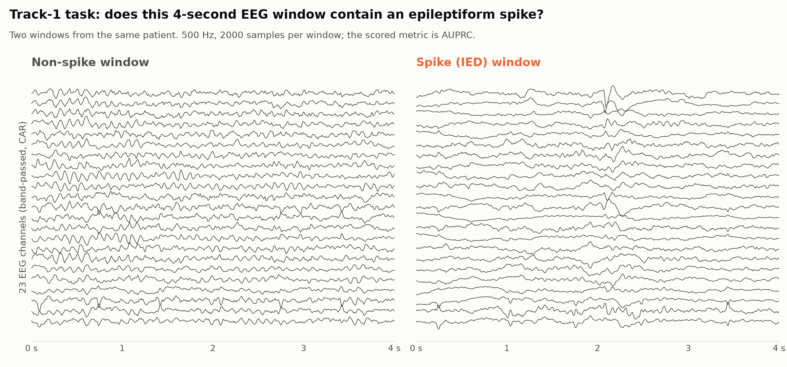
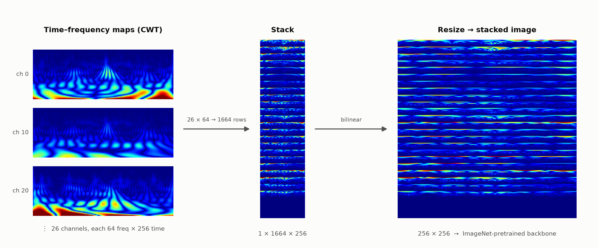
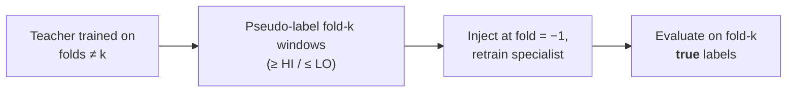

<div align="center">

# 🥇 Pushing Past Saturation
### An EEG Spike-Detection System for NeuroMM-2026 Track-1

**Rank-1 solution** · NeuroMM-2026 Grand Challenge, Track-1 (NMM-Basic-IED) · **ACM Multimedia 2026**

[](paper/PushingPastSaturation_NeuroMM2026_Track1.pdf)
[](https://www.codabench.org/competitions/16437/#/results-tab)
[](https://www.codabench.org/competitions/16437/#/results-tab)
[](#-code)
[](#-code)
[](https://huggingface.co/datasets/GG3BBE0/NeuroMM-T1-weights)
[](LICENSE)

*Ming-Chun Chiang · Kuan-Chuan Peng · Bo-Yun Yu · Jun-Wei Hsieh*<sup>✉</sup>

National Yang Ming Chiao Tung University · Mitsubishi Electric Research Laboratories

<sup>✉</sup> Corresponding author: Jun-Wei Hsieh (jwhsieh@nycu.edu.tw)

</div>

---

## 📌 TL;DR

Binary detection of **interictal epileptiform discharges (IEDs, "spikes")** in 4-second scalp-EEG
windows, scored by **AUPRC**. Our system combines domain-aware preprocessing, **five
time–frequency representations**, ImageNet-pretrained vision backbones, and a **regularized
Nelder–Mead ensemble**, reaching an inductive **0.9711** — where adding more architectures stops
helping. A pseudo-labelling warm-up lifts this to **0.9778**, and our **candidate-specialist
self-training** — many confident candidates, committed at **full weight**, audited by a
**candidate-excluded real-label CV gate** — reaches **0.9846, rank 1**.

> **The lesson:** on a saturated EEG benchmark, broad model diversity is not enough. The decisive
> lever is *quantity × commitment* of pseudo-labelled candidates, gated by validation that never
> sees a pseudo-label.

## 🏆 Results

**🥇 1st place** on the official Track-1 Test-Phase leaderboard — [Codabench, NeuroMM-2026 Track 1 (NMM-Basic-IED) → Results](https://www.codabench.org/competitions/16437/#/results-tab) (team `aicv1`, AUPRC **0.9846**).

| Stage | Leaderboard AUPRC | Regime |
|:---|:---:|:---:|
| Regularized Nelder–Mead ensemble (43 members) | 0.9711 | inductive (saturated) |
| + pseudo-labelling warm-up | 0.9778 | transductive |
| + candidate specialist (full weight) | 0.9818 | transductive |
| **+ teacher iteration (final)** | **0.9846** | **transductive · 🥇 rank 1** |

<div align="center">
<picture>
  <source media="(prefers-color-scheme: dark)" srcset="assets/score_ladder_dark.png">
  
</picture>
</div>

Each inductive step adds less than the previous one (+0.0199 → +0.0159 → +0.0058 → +0.0048);
further same-family architectures inflated in-sample CV without moving the leaderboard. The
transductive stage adds **+0.0135** without any new architecture. Re-deriving the ensemble weights
under eight bagging seeds keeps the leaderboard within 0.9842–0.9852, so the late steps are not
optimizer noise.

## 🧩 The task

| | |
|:---|:---|
| **Input** | 4-s windows, 2000 samples @ 500 Hz, 29 channels (EEG + ECG/EMG) |
| **Label** | spike (IED) vs. non-spike |
| **Training data** | 25,426 labelled windows, **patient-disjoint 5-fold CV**, 9.9 % positive (5.8 %–13.0 % per fold) |
| **Scored set** | 20,000 released unlabelled candidates |
| **Metric** | AUPRC |

<div align="center">
<picture>
  <source media="(prefers-color-scheme: dark)" srcset="assets/task_example_dark.png">
  
</picture>
</div>

Spikes are brief, sharp transients that often appear across neighbouring channels, but they vary in
morphology and sit on top of patient-specific background activity — which is why the system looks
at every window through several time–frequency representations rather than one.

The same spike window as the stacked-spectrogram models see it: each channel's time–frequency map
(the spike is the bright vertical burst at the centre of ch 0 and ch 10) is stacked along frequency
into one tall image and resized into a single square input for an ImageNet-pretrained backbone.

<div align="center">
<picture>
  <source media="(prefers-color-scheme: dark)" srcset="assets/concatspec_dark.png">
  
</picture>
</div>

## 🧠 Architecture

<div align="center">

</div>

- **Preprocessing** — 29 → 26 channels (scaled EEG + three bipolar ECG/EMG derivations). A
  band-passed branch adds a 0.5–70 Hz zero-phase Butterworth, 50 Hz notch, EEG-only common-average
  reference and robust `(x − median)/IQR` normalization.
- **Five time–frequency representations** — Morlet CWT, Paul-wavelet CWT, superlet (geometric mean
  of |CWT| over 3–7 cycles, batched-FFT GPU kernel), STFT, and CWT of the band-passed signal
  (BP-CWT).
- **Stacked-spectrogram CNN** — the `26 × F × T` map is stacked along frequency into one image,
  resized to 256² or 384², and fed to an ImageNet-pretrained `timm` backbone (MaxViT, ConvNeXt, …),
  following the channel-stacking scheme of a public HMS solution.
- **Multi-view time-domain model** — a learnable temporal-convolution filter bank (DW block)
  whose output is reordered into channel-major and frequency-major views, each with its own
  backbone; a simplified re-implementation of a public HMS design. Focal loss on the main head,
  BCE on auxiliary heads.
- **Regularized Nelder–Mead ensemble** — derivative-free AUPRC maximization over simplex weights
  (gradient/SLSQP solvers collapse to near-uniform), stabilized by *two-dimensional trimming*
  (drop only members that are both weak **and** near-zero weight), *bagging* over bootstrap
  resamples, and a *0.20 per-member cap*.
- **Candidate-specialist self-training** — the ensemble teacher pseudo-labels confident candidates
  (high tail → positive, low tail → negative, uncertain middle discarded); specialists are retrained
  and re-ensembled, and each round is accepted only if real-label CV improves.

### The `fold = −1` real-label gate

Every pseudo-labelled candidate is tagged `fold = −1`: always in training, **never in any
validation fold**. The CV that accepts or rejects a self-training round is therefore computed
entirely on real labels — if pseudo-label errors damage transferable decision structure, they show
up as a CV *drop*, not a spurious gain. This is what makes full-weight training affordable.

## ⚙️ How it works

| # | Stage | What happens | Code |
|:-:|:---|:---|:---|
| 0 | **Features** | Montage + filtering; cache the 7 inputs (raw / band-passed EEG, CWT, Paul, BP-CWT, superlet, STFT) | `scripts/precompute_*.py` |
| 1 | **Model pool** | Stacked-spectrogram CNNs × representations × {256, 384} px, multi-view models, legacy 1-D CNNs; two-stage fine-tuning (frozen 10 ep → unfrozen 30 ep), Adan + OneCycle + AMP | `neuromm26_baseline/tools/train_*_fold.py`, `scripts/dispatcher_*.py` |
| 2 | **NM ensemble → 0.9711** | Trim → bagged Nelder–Mead (40 bootstraps) → cap 0.20, weights fit on out-of-fold AUPRC | `scripts/regularized_nm_submission.py`, `scripts/regnm_real.py` |
| 3 | **Pseudo-label warm-up → 0.9778** | Few high-threshold candidates, down-weighted 0.4–0.5, `fold = −1` | `scripts/build_pseudo_dataset.py`, `scripts/build_nchc_submission.py` |
| 4 | **Candidate specialists → 0.9846** | 11,336 candidates (4,336 pos / 7,000 neg) at weight **1.0**; retrain 5 specialists (CWT / Paul / BP-CWT @256, superlet @384, multi-view) with focal loss | `scripts/build_pseudo_dataset_iter.py`, `scripts/dispatcher_nchc_specialist.py` |
| 5 | **Final build + checks** | Swap specialists in, re-derive NM weights (43 members), write the submission; nested-CV and held-out-fold replay | `scripts/build_specnchc_submission.py`, `scripts/honest_oof.py`, `scripts/build_private_sim.py` |

## 🔬 What made the difference

### Quantity × commitment beats conservative pseudo-labelling

The pseudo-label warm-up and the candidate specialist are the *same* procedure with opposite
hyper-parameters. Few, down-weighted pseudo-labels (2,695–3,438 candidates, weight 0.4–0.5) stall at
0.978 at every threshold we tried and give inconsistent per-model gains; many candidates at full
weight (11,336 at threshold 0.60, weight 1.0) lift every specialist.

<div align="center">
<picture>
  <source media="(prefers-color-scheme: dark)" srcset="assets/ablation_commitment_dark.png">
  
</picture>
</div>

At the ensemble level, swapping in the full-weight specialists raises **nested** out-of-fold AUPRC
by **+0.0386** over the inductive baseline — positive on all five seeds (+0.032 to +0.043) and
computed on real folds that never contain candidates. We read this for *direction*, not magnitude.

<div align="center">
<picture>
  <source media="(prefers-color-scheme: dark)" srcset="assets/specialist_gain_dark.png">
  
</picture>
</div>

### The specialists carry the final ensemble

<div align="center">
<picture>
  <source media="(prefers-color-scheme: dark)" srcset="assets/ensemble_weights_dark.png">
  
</picture>
</div>

### More findings

- **Augmentation is representation-dependent.** Heavy SpecAugment helps superlet@384 (+0.0167),
  Paul@256 (+0.008) and CWT@256 (+0.0036) but *hurts* BP-CWT@256 (−0.003; its input is already
  denoised). This — not representation superiority — explains the superlet member's large weight.
- **No single representation dominates.** At 384 px: Paul 0.858, superlet 0.849, CWT 0.841, with
  heavily overlapping bootstrap intervals.
- **Hard targets beat soft targets at saturation.** A Noisy-Student-style soft-target variant gains
  only +0.0020 nested CV, inside the ±0.005–0.01 noise floor.

### Held-out-fold generalization check

Because the leaderboard gain is in-sample by design, we replay the whole procedure on labelled data:



Δ (specialist − canonical) is positive on **4 / 5 folds** for both CWT (mean +0.0318) and the
multi-view model (mean +0.0547); fold 4 is the only non-positive fold in both. A stronger teacher
yields a larger gain (+0.0318 vs +0.0022 for a weak single-model teacher). We read this as
**suggestive of partial transfer, not proof** that the gain is free of candidate-specific adaptation.

## 📁 Code

This repository contains the full pipeline source for reference; it is shared to document the
method rather than as a turnkey reproduction package.

```
neuromm26_baseline/     models (stacked-spectrogram CNN, multi-view, 1-D CNNs), datasets, losses, trainers
scripts/                feature precompute, training launchers, Nelder–Mead ensemble,
                        pseudo-label / candidate-specialist builders, validation (nested CV, held-out-fold replay)
submissions/            the scored 0.9846 submission
docs/                   stage-by-stage technical notes (REPRODUCTION.md) and the checkpoint manifest
paper/                  published paper (PDF)
```

Trained weights are archived on 🤗 [`GG3BBE0/NeuroMM-T1-weights`](https://huggingface.co/datasets/GG3BBE0/NeuroMM-T1-weights).

## ⚖️ Scope and rules

- The released candidates were used as **unlabelled** training data, which the challenge permits;
  **no hidden labels were used anywhere**.
- The final regime is **transductive by design**: specialists train on pseudo-labelled members of
  the scored pool (~57 % of it), so 0.9846 carries an in-sample component. Out-of-sample transfer is
  assessed separately by the held-out-fold replay above.
- The recipe needs the scored set to exist before training — true for challenges and retrospective
  review of an archived corpus, not for prospective monitoring, where test-time adaptation is the
  analogue.
- The raw EEG is **not redistributed** here; obtain it from the NeuroMM-2026 organizers.
- Code is released under the [MIT License](LICENSE).

## 🙏 Acknowledgements

The stacked-spectrogram CNN follows the channel-stacking scheme of a public HMS Harmful Brain
Activity Classification solution (suguuuuu), and the multi-view model is a simplified
re-implementation of another (muku). Backbones come from
[`timm`](https://github.com/huggingface/pytorch-image-models). Thanks to the NeuroMM-2026 organizers
for the challenge and data.

The paper appears in the Proceedings of the 34th ACM International Conference on Multimedia
(MM '26), DOI [10.1145/3767308.3837695](https://doi.org/10.1145/3767308.3837695) (active once the
proceedings are published); the published PDF is in [`paper/`](paper/).
